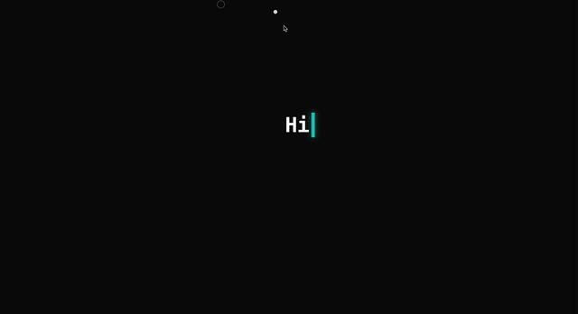
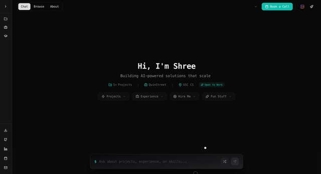

# Shree-Portfolio





A modern, AI-powered portfolio website featuring a chat-first interface where visitors can ask natural language questions about projects, experience, and skills. Built with Next.js 16, React 19, TypeScript, and OpenAI's GPT-4o-mini with RAG (Retrieval-Augmented Generation).

## 🚀 Features

- **Chat-First Interface** - Natural language Q&A about portfolio content with streaming responses.
- **Archive Mode** - An immersive, draggable photo gallery with a rainbow gradient icon and lightbox view.
- **Browse Mode** - Traditional portfolio view with filtering, sorting, and comparison.
- **Smart UI** - Custom cursor, scroll progress line (on About page), dark/light mode, and theme color picker.
- **Context-Aware Chat** - Focus conversations on specific projects or experiences.
- **Interactive Elements** - Random prompt button, dropdown suggestions, and smooth animations.
- **Admin Dashboard** - Internal tools for content management.
- **Responsive Design** - Mobile-first, accessible, and performant.

## 📚 Documentation

Comprehensive technical documentation is available in the [`docs/`](./docs/) folder:

- **[Overview](./docs/00-OVERVIEW.md)** - Project summary, tech stack, quick start
- **[Architecture](./docs/01-ARCHITECTURE.md)** - System design, data flow, diagrams
- **[AI/RAG System](./docs/02-AI-RAG-SYSTEM.md)** - Embeddings, vector search, prompts
- **[Chat Interface](./docs/03-CHAT-INTERFACE.md)** - Chat UI, streaming, animations
- **[Browse/Catalog](./docs/04-BROWSE-CATALOG.md)** - Browse mode, filtering, sorting
- **[Layout Components](./docs/05-LAYOUT-COMPONENTS.md)** - Header, sidebar, details panel
- **[UI Components](./docs/06-UI-COMPONENTS.md)** - Reusable components library
- **[Data Model](./docs/07-DATA-MODEL.md)** - Portfolio data structure, types
- **[State Management](./docs/08-STATE-MANAGEMENT.md)** - Zustand store, patterns
- **[Styling & Theming](./docs/09-STYLING-THEMING.md)** - Tailwind, CSS variables, animations
- **[API Routes](./docs/10-API-ROUTES.md)** - Backend endpoints, streaming, security

## 🛠️ Tech Stack

**Frontend:** Next.js 16, React 19, TypeScript, Tailwind CSS 4, Framer Motion, Radix UI

**State:** Zustand with persistence

**AI/Backend:** OpenAI GPT-4o-mini, text-embedding-3-small, Supabase (PostgreSQL + pgvector)

**Deployment:** Vercel

## 🚦 Quick Start

```bash
# Navigate to project
cd Shree-Portfolio/shree-portfolio

# Install dependencies
npm install

# Set up environment variables
# Create .env.local with:
# OPENAI_API_KEY=sk-proj-...
# SUPABASE_URL=https://....supabase.co
# SUPABASE_SERVICE_ROLE_KEY=eyJhbGci...

# Run development server
npm run dev

# Open http://localhost:3000
```

## 📖 Key Concepts

### Chat-First Interface
The primary interaction is conversational. Users ask questions, and the AI assistant provides contextual answers with citations linking to source material.




### Archive Mode
A unique, visual way to explore the portfolio through a draggable canvas of photos. Accessible via the rainbow gradient icon in the header.


### RAG (Retrieval-Augmented Generation)
1. User query → generate embedding
2. Search vector store for relevant content
3. Build prompt with retrieved context
4. Stream GPT-4o-mini response
5. Display with citations

## 🎨 Features in Detail

### Chat Interface
- Streaming AI responses with typing animation
- Context-aware prompt suggestions
- Citation system linking to source material
- Keyboard shortcuts (Cmd+K, Escape)
- Rate limiting (20 requests/hour)

### Archive Mode
- Draggable infinite canvas
- Lightbox view for photos
- Smooth transitions and animations
- Hidden sidebar for immersive experience

### Browse Mode
- Filterable project grid (by category, year)
- Sortable (recent, alphabetical, impact)
- Groupable (by category or year)
- Compare mode for side-by-side analysis
- Details panel with full information

### Design System
- Dark/light mode toggle
- 8 accent colors (teal, blue, pink, orange, yellow, green, red, violet)
- Smooth Framer Motion animations
- Accessible (Radix UI, keyboard nav, ARIA)
- Mobile-first responsive design

## 📝 Common Tasks

### Adding a New Project
Edit `src/data/portfolio.ts` and add to the `projects` array. See [Data Model docs](./docs/07-DATA-MODEL.md#adding-a-new-project).

### Modifying AI Behavior
Edit `src/lib/ai/config.ts` for model settings or `src/lib/ai/prompts.ts` for system prompt. See [AI/RAG docs](./docs/02-AI-RAG-SYSTEM.md#configuration-configts).

### Changing Theme Colors
Edit `src/app/globals.css` for CSS variables. See [Styling docs](./docs/09-STYLING-THEMING.md#accent-colors).

## 🔒 Security

- Rate limiting (20 requests/hour per IP)
- Input validation and sanitization
- Parameterized database queries
- React auto-escapes, ReactMarkdown sanitizes

## ♿ Accessibility

- Keyboard navigation (Tab, Enter, Escape, Cmd+K)
- ARIA labels on interactive elements
- Focus management in modals/panels
- Semantic HTML structure
- Color contrast compliance (WCAG AA)
- Screen reader friendly

## 📧 Contact

- **Email:** bohara@usc.edu
- **GitHub:** [ShreeBohara](https://github.com/ShreeBohara)
- **LinkedIn:** [shree-bohara](https://www.linkedin.com/in/shree-bohara/)
- **Schedule a Call:** [Calendly](https://calendly.com/shreetbohara/connect-with-shree)

## 📄 License

This is a personal portfolio project. All rights reserved.
