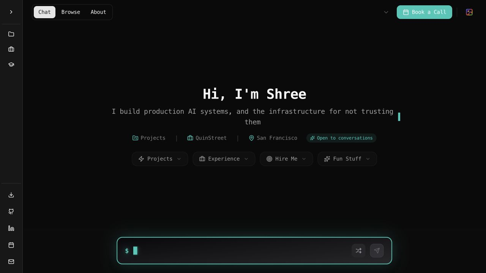

# Portfolio restoration and project review

Reviewed 4 October 2026. Scope: restore the original deployed UI, remove conflicting local work and misleading documentation, fix reproducible bugs, and verify the result. A new design or broad content refresh is a later decision.

## Restoration evidence

Vercel reports deployment `dpl_Fifw45i8wLM2MUJ4t8fXPNqW6Qid` as READY and assigned to `shreebohara.com` and `www.shreebohara.com`. Its Git commit is `5683076814ed3552fcce62b4c02ec756a3b5a94d`.

That commit preserves the original chat/browse/about/archive design, with the already deployed security, identity, first-paint and tooling fixes. Those fixes were retained. The redesign begins at `d7d3865`, after that deployed baseline, and continues through Phase 5 to branch `redesign` at `e93fb5f`. None of those later design changes is part of the active site now.

The actual redesign checkout was `/Users/shree/Projects/shree-portfolio`. The desktop checkout was a stale March copy at `4aa48aa`, with an uncommitted project grid change and an iCloud conflict duplicate. Its newly fetched Git pack became a dataless iCloud placeholder and stopped being readable by Git. Continuing to use two checkouts would have recreated the same problem.

The active repository is now `/Users/shree/Projects/shree-portfolio`, on `main`. `/Users/shree/Desktop/Portfolio/Shree-Portfolio` links to it. The prior desktop checkout is preserved at `/Users/shree/Desktop/Portfolio/.previous-checkout-2026-10-04`; its separate local changes, historical analysis, verified complete Git bundle and previous generated caches are at `/Users/shree/Projects/portfolio-recovery-2026-10-04`. The rejected phase branches remain intact. Credentials were preserved without publishing them.

Production was left unchanged. No Git pushes, Vercel deployments, database migrations or index writes were performed during this restoration.

## Bugs corrected locally

| Area | Reproduced problem | Correction |
| --- | --- | --- |
| Chat failures | Stream error events were caught as JSON parse errors and silently discarded; truncated streams appeared complete. | Shared NDJSON reader surfaces errors, handles UTF-8/network splits and final lines, and requires a completed answer. Submission and retry share this code; reset/unmount cancels the request and ignores stale answer chunks. |
| Retrieval | The route could fail before its unavailable-service response; fallback retrieval could leave the selected item and change sources after citation metadata had already been sent. | Preparation resolves every retrieval/fallback before generation or citations. Missing services and no supporting material avoid model calls. Both response modes use the same sources; a known selected page can supply its current local chunks when global capped search misses it. |
| Request validation | Malformed JSON, null bodies and whitespace queries could become server errors or invoke retrieval. | Return 400 for invalid bodies, queries, stream flags and selected-item context before service work. |
| Privacy refusals | Full work authorization questions missed an incomplete regex; technical questions about rate limiting and package managers were incorrectly refused. | Correct word boundaries and compensation-specific phrases, with regression examples. |
| Quotas | Upstash rejection was reported using local-memory counters, including a one-minute retry for a daily block. | Report actual durable counters and fixed-window reset times, including UTC midnight for daily quotas and out-of-order response handling. |
| Browse | Invalid section parameters rendered an empty catalog; sidebar selection did not update the URL. | Validate sections and keep sidebar navigation, reload, sharing and browser history consistent. |
| Project details | Cards required a pointer; details lacked keyboard dismissal and focus handling. | Enter/Space opening, Escape closing, focus return, and mobile dialog focus trapping. Hidden mobile sidebar controls are inert. |
| Photos | Saved flat database adjustment columns were ignored by the nested gallery filter shape; missing credentials could crash route initialization. | Normalize filters/crops, preserve zero values, reject invalid crops, and initialize the read-only API inside its guarded handler. |
| Archive lifecycle | Timers, fetches, image callbacks and animation work could survive navigation and corrupt a remounted gallery; stalled images could prevent entry indefinitely. | Cancel owned work on cleanup and bound loading. Keyboard photo opening, labeled lightbox controls, focus trapping and focus return after the exit animation preserve the original canvas design. |
| Index maintenance | Reindexing deleted the working index before calling the embedding provider. | Prepare complete replacement embeddings first, store them successfully, then prune obsolete IDs. Validate all replacement IDs, dimensions and values before writes. Initial count failures cannot bypass the force guard; final counts must match. Failed generation leaves the working index intact. |

These changes preserve the deployed visual layout and existing personal/project information. The recovery branch retains the later case-study drafts for a future information refresh.

## Verification

`npm run check` completed successfully on Node 20.19.0. It includes TypeScript, ESLint, 39 regression tests, 26 content rules, reconciliation of 11 corpus-cited metrics, and the optimized production build. No tests failed or were skipped. ESLint reports 56 inherited warnings and zero errors; warnings include unused code, broad types, native images and legacy effect patterns. The build also reports the existing edge-runtime deprecation for the image endpoint. The complete output is saved at `/Users/shree/Projects/portfolio-recovery-2026-10-04/check.log`.

The optimized local server passed 24 public route/asset checks, including all generated project, experience and work pages, the résumé, profile image, metadata routes and social image endpoint. Retired experience/project links redirect correctly.

Manual browser checks covered the original desktop home, Browse sidebar URL changes and reload persistence, invalid-section fallback, keyboard project opening/dismissal/focus return, and a 390-pixel mobile viewport with no horizontal overflow. The mobile details dialog traps focus and the closed sidebar is inert. Chat reset while a reply is pending leaves the welcome screen without a stale answer or loading state. Photo checks covered all 68 loaded controls, canvas dragging, pointer and keyboard opening, arrow navigation, Tab wrapping, Escape dismissal and return to the opening photo. Closing a photo preserves the canvas position.

A read-only Supabase check compared every saved chunk ID and content string against `chunkAllContent` from the restored source: 97 expected, 97 present, zero missing, zero obsolete, zero changed. All saved rows were indexed on 2 September 2026. This confirms index/source consistency, not model answer quality.

The existing photo API returned 68 photos, including saved filter adjustments for all 68 and crop data for three. No photo records were changed. Removed write routes remain unavailable: archive POST returns 405, admin reindex returns 404.

## Project structure and next work

The original catalog and its chat index use `src/data/portfolio.ts`. The separate MDX content layer has two validated work pages; it is not the catalog's source yet. This split explains why newer case studies do not automatically appear in the original UI. The previous README described removed comparison, filtering, theme picker, cursor and admin features; it now documents actual behavior. The old guides and media remain under `docs/legacy`, marked historical.

The next useful step is a content refresh within this original UI: inventory current projects, verify their descriptions/links/screenshots against the résumé corpus, decide the public project order, and connect approved material to the catalog and chat index together. Corporate experience content must still follow the corpus import policy. Avoid copying the rejected redesign's content wholesale without checking provenance and current claims.

After the information is accurate, choose a visual direction from a small number of reviewable mockups before implementing it. The original layout remains the reference until Shree approves a replacement.

## Limits of this review

- Live Vercel still runs the deployed baseline. The new bug fixes are local; publishing them is a separate action.
- Tests use mocked OpenAI/Redis/database failures. The local browser tested graceful chat unavailability with the OpenAI key disabled. No paid generation was run, so answer quality and live provider latency were not evaluated here.
- Local Upstash variables are absent. The existing per-instance limiter remains the fallback; durable account configuration on Vercel was not changed or inspected through secret endpoints.
- The current index refresh avoids destructive delete-first failure, but a multi-batch refresh is not an atomic database generation swap. That would require a separate coordinated data change if the index grows substantially or concurrent maintenance becomes necessary.
- Content lint covers the original source and forbidden strings; metric reconciliation covers the MDX metrics cited to the corpus. Neither is proof that every narrative sentence is independently verified. A broad information update is still needed before changing the design.
- Inherited lint warnings are recorded with the final checks. Passing checks do not mean every legacy typing, animation or accessibility issue is eliminated.
